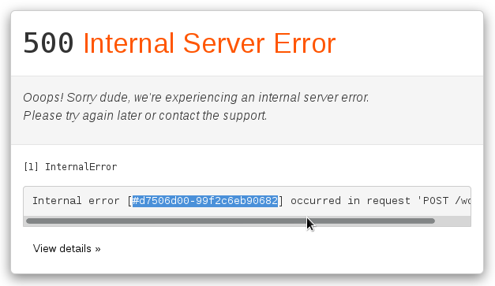
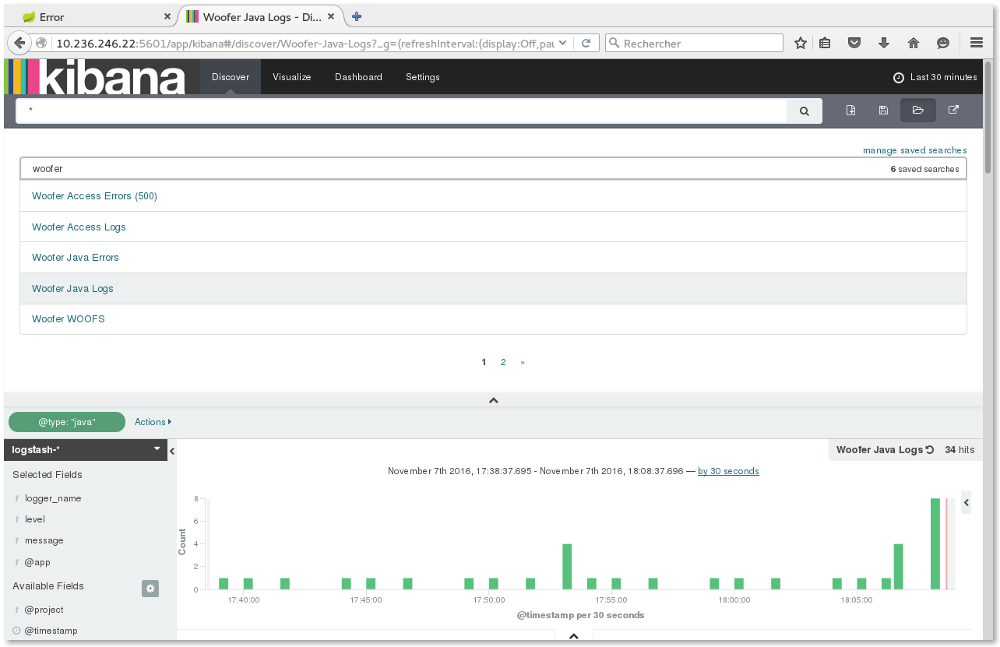
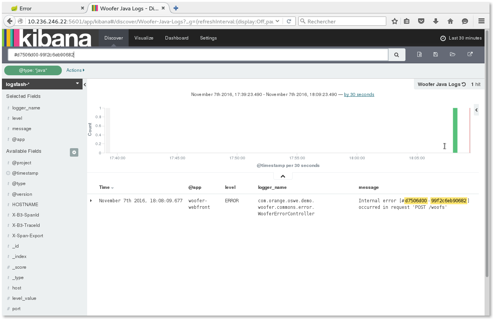
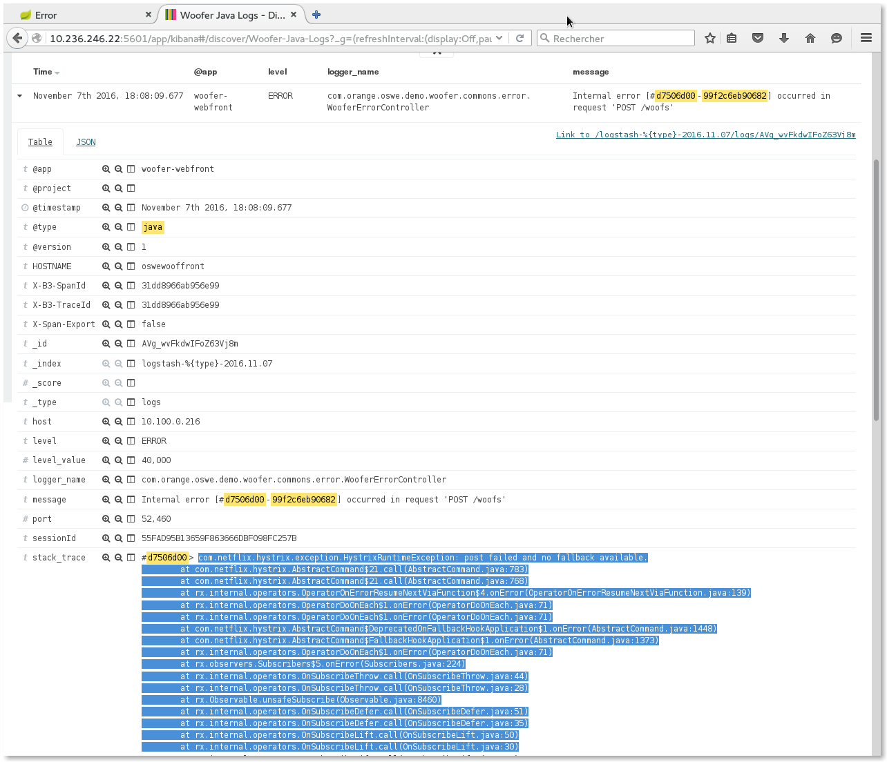
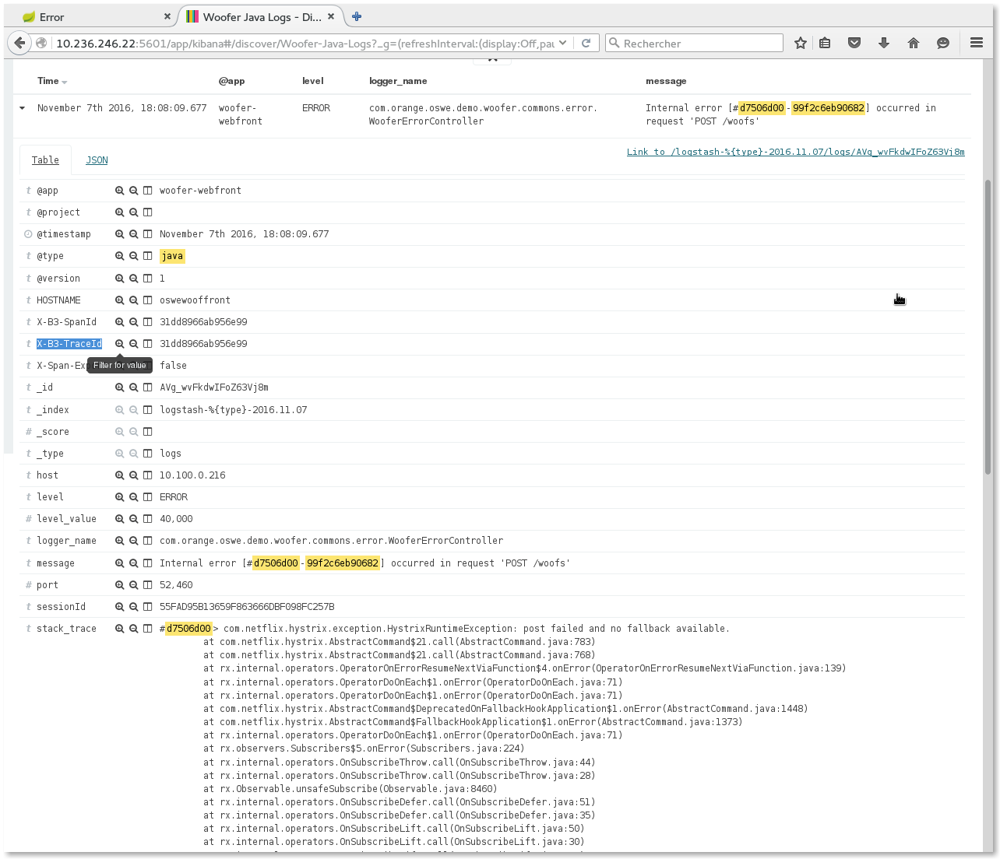
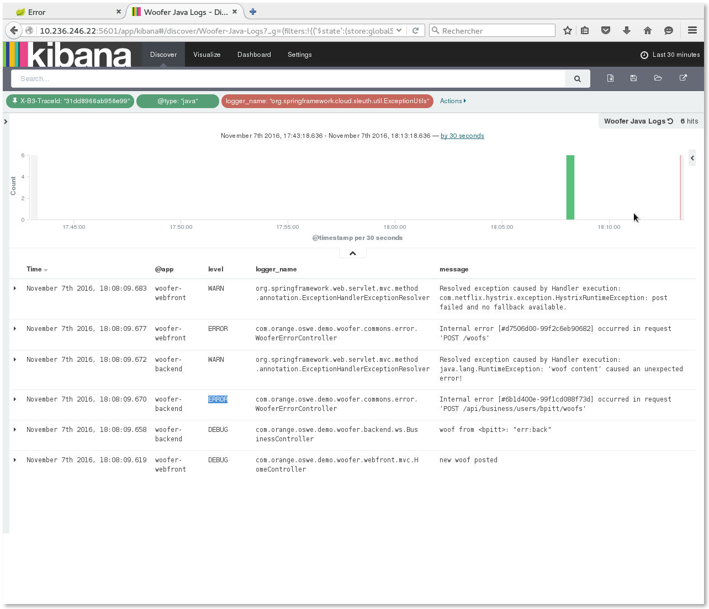
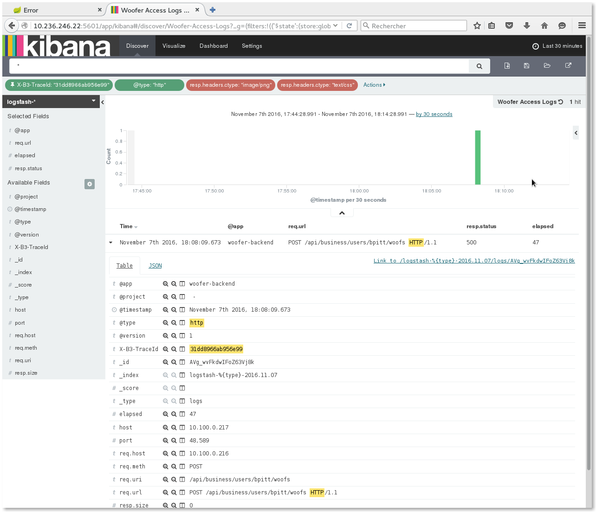

# Incident Analysis with ELK

This tutorial shows how incredibly code & libs used in Woofer will help you in your incident analysis using Kibana.

<iframe width="800" height="450" src="https://www.youtube.com/embed/aL57fSimq5I" frameborder="0" allowfullscreen></iframe>

---

## Generate an internal error

1. [Login to Woofer](/),
2. Post a woof that contains the ''err:back'' text,
3. You should get an error page:

4. Copy the error unique ID (`#d7506d00-99f2c6eb90682` in above example).

---

## Retrieve the complete stack trace

1. Go to **Kibana**,
2. Open the **Woofer Java logs** saved search,

3. Paste the error unique ID in the search input field and press `RETURN`,

4. You should get the originating error. Expand it, and you get the complete stack trace !

---

## Filter logs from the request

If the stack trace is not enough to analyze the issue and if you need to know what was processed previously during the request, you may filter logs
by `X-B3-TraceId` (unique _treatment_ ID generated by [Spring Cloud Sleuth](https://cloud.spring.io/spring-cloud-sleuth/)).

1. click the `+` magnifier icon on the `X-B3-TraceId` field: that will add the `X-B3-TraceId: "xxxxxxxx"` to the current query,

2. clear the Kibana search input field and press `RETURN`,
3. You should now see ALL Java logs holding this trace ID (i.e. all logs produced during the processing of this treatment).
By the way, notice in the **@app** column that traces originate both from `woofer-webfront` and `woofer-backend` components, *for the same trace*...

---

## Retrieve the access log(s)

Let's notice that - thanks to our logging configuration - the `X-B3-TraceId` is also logged in access logs: you can also find the 
access logs with complete details if required.

Here is how to retrieve it from previous step:

1. pin the `X-B3-TraceId: "xxxxxxxx"` filter,
2. Open the **Woofer access logs** saved search,
3. You should now see all access logs from every component with this trace ID:

NOTE: Actually we get only the access log from `woofer-backend` because - for technical reasons - we could not have the `woofer-webfront` embedded 
Tomcat catch the original `X-B3-TraceId`. Only subsequent Tomcats do...

---

## Filter logs by the session or by user

Similarly to filtering logs by `X-B3-TraceId`, you may also filter them by `sessionId` (to analyze the complete user activity during his JEE session),
or even by `userId` (complete user activity over time).
